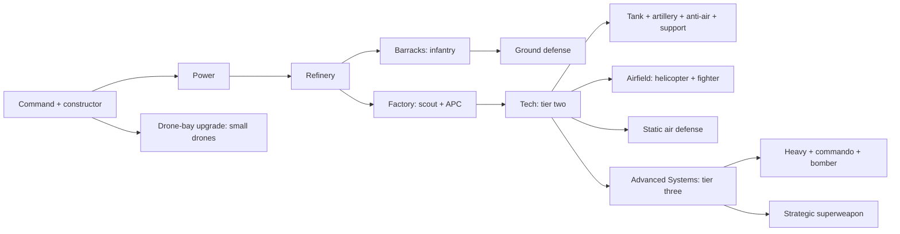

# Neon Frontier — two-army design atlas

Neon Frontier is an original cyberpunk RTS concept inspired by the readable silhouettes, asymmetric factions, resource raids, and combined-arms battles of classic modern-warfare strategy games. The Pacific Vanguard explores an advanced American-style expeditionary force; the Crimson Dynasty explores an advanced Chinese-style industrial army. The project uses original models and faction identities.

The Unity project contains **two complete concept rosters: 16 mobile units and 10 structures per faction, 52 designs in total**. Every design has an original Blender model, a reusable Unity prefab, an editable `ArmyDefinition` asset, and an instance in the inspection scene.

This is an interactive **art and army-layout prototype**. Camera movement, faction navigation, category filtering, model selection, and specification cards work. Combat, unit orders, pathfinding, production, income, research, special abilities, animation, multiplayer, and victory conditions are design proposals and are not simulated. All displayed cost, health, range, and speed figures are initial design values; they are not validated balance numbers.

## Open and inspect

Open the generated army showcase scene and enter Play mode. The left browser selects a faction, filters its roster, and focuses individual models. Each base has a headquarters, power, resources, production, technology, defenses, and a strategic weapon. Units are organized in a separate four-by-four display formation below the base.

| Control | Action |
|---|---|
| WASD or arrow keys | Pan the camera |
| Shift + pan | Move faster |
| Mouse wheel | Zoom |
| Middle mouse drag | Drag the ground under the camera |
| Q / E | Orbit around the current focus |
| 1 / 2 | Focus Pacific Vanguard / Crimson Dynasty |
| Left-click a model | Select it and inspect its specification card |
| Click a roster entry | Select and focus that model |
| F | Focus the selected model |
| Home / Overview button | Restore the opening overview |
| Escape / Close | Clear the selection |
| H | Hide or show the inspection interface |

Clicking the interface does not select objects behind it. The scene uses Unity's Input System package and IMGUI, so there is no dependency on downloaded fonts or UI packages. Model colliders are for inspection picking; they are not navigation or combat hitboxes.

## Faction identities

| Design dimension | Pacific Vanguard | Crimson Dynasty |
|---|---|---|
| Doctrine | Precision, information, expensive survivable combined arms | Industrial scale, armored pressure, area denial |
| Main palette | Ivory armor, navy recesses, cyan emitters | Charcoal armor, crimson panels, amber emitters, warm metal |
| Shape language | Beveled wedges, clean panel breaks, low profiles, optical arrays | Broad hulls, layered plates, twin weapons, exposed cooling and machinery |
| Battlefield advantage | Accurate engagements, air control, sensors, sustained valuable units | Durable armor, economical forces, formation pressure, saturation fire |
| Intended limitation | Losing specialist support is expensive; outnumbered fronts need maneuver | Slow heavy units are vulnerable to range, flanks, and aircraft |
| Infantry identity | Professional modular armor and specialist equipment | Heavy silhouettes and rugged powered equipment |
| Base identity | Modular aerospace campus with luminous communications | Fortified industrial complex with tall machinery and heavy production |

Use emissive color as a secondary identification cue. Silhouette and equipment should still communicate role when zoomed out or seen in grayscale. Both factions need every essential strategic role; asymmetry comes from cost, durability, precision, mobility, firing pattern, and support rather than removing necessary counters.

## Pacific Vanguard mobile roster

Costs are proposed credits. Tiers describe intended unlock timing. All physical models are static; the role column describes intended future gameplay.

| ID suffix | Name | Category | Tier | Cost | Role / intended advantage | Main counter |
|---|---|---|---:|---:|---|---|
| Worker | MULE Fabricator | Vehicle | 1 | 600 | Four-wheel constructor; buildings and field repair | Scouts and worker raids |
| Rifle | Neon Ranger | Infantry | 1 | 200 | General-purpose rifle infantry; cover and garrisons | Area weapons and armor |
| Rocket | Arc Lancer | Infantry | 1 | 350 | Guided anti-armor and anti-air infantry | Suppression and close infantry |
| Engineer | Ghostwire Specialist | Infantry | 1 | 450 | Capture neutral objectives; electronic support | Direct combat and fast raiders |
| Commando | Specter Operative | Infantry | 3 | 1,600 | Elite sabotage, precision fire, proposed camouflage | Detection and area damage |
| Scout | Wisp Recon Buggy | Vehicle | 1 | 500 | Fast four-wheel reconnaissance and worker pressure | Tanks and rockets |
| APC | Aegis IFV | Vehicle | 1 | 800 | Six-wheel troop transport with remote cannon | Heavy armor and rockets |
| Tank | Paladin Railtank | Vehicle | 2 | 1,200 | Accurate single-railgun main battle tank | Flanking swarms and artillery |
| Heavy | Atlas Siege Tank | Vehicle | 3 | 2,500 | Heavy tracked breakthrough with twin rail weapons | Air strikes and mobile artillery |
| Artillery | Longbow Coil Battery | Vehicle | 2 | 1,400 | Long-range precision rail howitzer | Fast flanks and aircraft |
| AntiAir | Halo Interceptor | Vehicle | 2 | 1,000 | Tracked eight-cell SAM and phased-array radar | Tanks and ground artillery |
| Support | Nexus Field Rig | Vehicle | 2 | 950 | Six-wheel repair and electronic support vehicle | Focus fire and unsupported fighting |
| Drone | Firefly Attack Drone | Aircraft | 1 | 450 | Four ducted fans; scouting and light harassment | Dedicated anti-air and armor |
| Helicopter | Valkyrie Gunship | Aircraft | 2 | 1,600 | Main-and-tail-rotor precision anti-armor helicopter | Fighters and layered air defenses |
| Fighter | Razorwing Interceptor | Aircraft | 2 | 1,800 | Swept-wing twin-engine fighter; air control | Prepared SAM coverage and attrition |
| Bomber | Eclipse Stealth Bomber | Aircraft | 3 | 2,800 | Broad-wing twin-engine strategic precision bomber | Detection, interceptors, and rearm timing |

Vanguard's proposed signature loop is **scout → isolate → strike → repair**. Wisp and Firefly provide information, Paladins and Arc Lancers control engagement lanes, and Nexus rigs preserve expensive machines. Longbow batteries reward good spotting; aircraft open routes around a grounded defense. An Atlas without Halo coverage should remain vulnerable.

## Crimson Dynasty mobile roster

| ID suffix | Name | Category | Tier | Cost | Role / intended advantage | Main counter |
|---|---|---|---:|---:|---|---|
| Worker | Ox Foundry Crawler | Vehicle | 1 | 500 | Tracked constructor with manipulator and blade | Air harassment and raiders |
| Rifle | Redline Legionary | Infantry | 1 | 150 | Affordable armored line infantry; map control | Area damage and suppression |
| Rocket | Thunder Spear | Infantry | 1 | 300 | Concentrated heavy rocket volleys | Artillery and anti-infantry vehicles |
| Engineer | Circuit Adept | Infantry | 1 | 400 | Capture and infrastructure support | Raiders and frontline combat |
| Commando | Jade Phantom | Infantry | 3 | 1,500 | Elite disruption, precision fire, demolition | Detection and concentrated fire |
| Scout | Jackal Recon Buggy | Vehicle | 1 | 400 | Four-wheel twin-gun recon and worker raids | Armor and prepared defenses |
| APC | Bastion Troop Carrier | Vehicle | 1 | 700 | Six-wheel transport with suppressive twin cannon | Battle tanks and guided rockets |
| Tank | Longma Battle Tank | Vehicle | 2 | 1,000 | Durable tracked twin-cannon tank | Precision railguns and flanks |
| Heavy | Qilin Twin-Cannon | Vehicle | 3 | 2,400 | Super-heavy tracked ground breakthrough | Aircraft and long-range artillery |
| Artillery | Firestorm Rocket Array | Vehicle | 2 | 1,300 | Six-cell rocket artillery for area denial | Fast raids and dispersed targets |
| AntiAir | Skyguard Missile Carrier | Vehicle | 2 | 850 | Tracked eight-cell SAM screen with radar | Heavy armor and ground artillery |
| Support | Forge Repair Carrier | Vehicle | 2 | 800 | Six-wheel field forge and repair manipulators | Air raids and focus fire |
| Drone | Cinder Swarm Drone | Aircraft | 1 | 350 | Cheap four-ducted-fan reconnaissance and pressure | Dedicated anti-air and armor |
| Helicopter | Redkite Assault VTOL | Aircraft | 2 | 1,450 | Main-and-tail-rotor armored helicopter, twin chin guns | Interceptors and layered anti-air |
| Fighter | J-88 Stormblade | Aircraft | 2 | 1,600 | Swept-back twin-engine interception and short strikes | Prepared air defenses and rearm windows |
| Bomber | Heavenfall Arsenal Plane | Aircraft | 3 | 2,600 | Heavy twin-engine broad-wing area bombardment | Interceptors and scattered targets |

Dynasty's proposed signature loop is **produce → mass → advance → sustain**. Legionaries and Bastions secure the front, Longmas carry the pressure, and Forge carriers reduce the cost of prolonged engagements. Firestorm batteries force defenders to move into the armor line. Qilins win ground space while Skyguards make aerial punishment more difficult. Splitting the heavy formation should create meaningful vulnerability.

## Complete base rosters

Each army has ten structural roles. Tier-one factories produce only entry-level vehicles; advanced units remain locked behind technology. Airfields use circular VTOL landing pads and are tier two, while small tier-one drones have a proposed headquarters drone-bay unlock. Fixed-wing aircraft would need a future vertical landing animation or a larger airfield footprint; the atlas presents them as static miniatures.

| ID suffix | Pacific Vanguard | Tier | Cost | Purpose |
|---|---|---:|---:|---|
| Command | Vanguard Command Nexus | 1 | 2,500 | Headquarters, workers, construction access |
| Power | Helios Fusion Plant | 1 | 800 | Base power |
| Refinery | Quantum Supply Hub | 1 | 1,200 | Resource collection and supply logistics |
| Barracks | Ranger Deployment Center | 1 | 700 | Infantry recruitment |
| Factory | Aegis Motorworks | 1 | 1,500 | Vehicle production |
| Airfield | Vector Flight Deck | 2 | 1,800 | Aircraft production, landing, rearming |
| Tech | Prism Research Institute | 2 | 2,000 | Advanced technology and upgrades |
| Turret | Sentry Rail Emplacement | 1 | 850 | Ground-defense precision railgun |
| AirDefense | Aureole SAM Grid | 2 | 1,000 | Static anti-air and proposed detection |
| Superweapon | Aurora Orbital Uplink | 3 | 5,000 | Proposed charged orbital precision strike |

| ID suffix | Crimson Dynasty | Tier | Cost | Purpose |
|---|---|---:|---:|---|
| Command | Dynasty Directorate | 1 | 2,500 | Headquarters, workers, construction access |
| Power | Dragonheart Reactor | 1 | 700 | Base power; proposed risk/reward overclock |
| Refinery | Iron Tributary Depot | 1 | 1,100 | Resource collection and industrial logistics |
| Barracks | Legion Muster Hall | 1 | 600 | Infantry recruitment |
| Factory | Ironclad Assembly Works | 1 | 1,400 | Vehicle production |
| Airfield | Stormblade Aerodrome | 2 | 1,700 | Aircraft production, landing, rearming |
| Tech | Jade Signal Academy | 2 | 1,800 | Heavy technology and upgrades |
| Turret | Ironwall Twin-Rail Bastion | 1 | 750 | Twin-rail armored ground defense |
| AirDefense | Skywall Missile Tower | 2 | 900 | Static eight-tube anti-air missile defense |
| Superweapon | Heavenforge Particle Spire | 3 | 5,000 | Proposed charged area particle discharge |

## Proposed progression and economy

The following is a future implementation specification. These prerequisites and abilities are not enforced by the atlas.

1. **Opening / tier one:** Start with one Command building and one constructor. Build Power and a Refinery, then Barracks and Factory. Rifle, Rocket, Engineer, Scout, and APC units are available from their production buildings. A small drone-bay upgrade at Command opens tier-one Drone production without an Airfield. Basic ground defense is available after Barracks.
2. **Combined arms / tier two:** Power + Refinery + Factory permit construction of Tech. Completing Tech opens Tank, Artillery, AntiAir, and Support production at Factory, as well as Airfield and static AirDefense construction. Airfield produces Helicopter and Fighter designs. This makes access to aircraft follow access to reliable anti-air.
3. **Late game / tier three:** A proposed Advanced Systems research at Tech opens Heavy vehicles, the Commando at Barracks, the Bomber at Airfield, and Superweapon construction. Proposed limits: one living Commando and one Superweapon per faction. Neither limit is currently implemented.

Use a common credits economy supplied by resource depots and constructors hauling materials. Income rates, travel time, resource amounts, build times, ammunition, upkeep, supply limits, and research prices remain deliberately unspecified until a playable economy exists. Start by tuning the opening around an affordable scouting opportunity and an exposed supply route. A free starting headquarters is an initial condition; its catalog cost describes rebuilding it.

Power should matter without instantly deciding the match: a future low-power state can suspend advanced production, defensive targeting, and superweapon charging while allowing units, constructors, and basic income to continue. Show the state clearly and allow recovery. A headquarters loss should remove headquarters functions while surviving constructors retain the ability to rebuild; the final victory rule is still to be designed.

## Counters and force composition

| Threat | Intended response | Counterplay for the attacker |
|---|---|---|
| Infantry mass | IFV/Bastion fire and area artillery | Spread out, use cover, add anti-armor infantry |
| Tank column | Rocket infantry in cover, rail tanks, attack helicopters | Infantry screen, artillery, mobile SAM escort |
| Heavy breakthrough | Long-range artillery, aircraft, multi-direction pressure | Recon, repairs, air-defense coverage |
| Static defenses | Artillery and supported bombers | Counter-battery scouts, fighter interception, mobile reserve |
| Aircraft | Rocket infantry early; mobile SAMs, static anti-air, fighters later | Scout coverage, split attacks, strike during repositioning |
| Stealth or sabotage | Engineer sensors and proposed detection upgrades | Attack isolated targets and avoid established sensor nets |
| Expensive support | Fast scouts, flankers, precision air attacks | Escorts and disciplined positioning |
| Superweapon charging | Visible timer encourages scouting, power raids, or direct attack | Layered defense, decoys, economy investment |

Three illustrative future army compositions:

- **Vanguard mobile task force:** Paladins + Aegis carriers with Rangers and Arc Lancers + a Nexus rig + a Halo escort. Add Wisp spotting and a Valkyrie when enemy anti-air is weak.
- **Dynasty industrial push:** Longmas + Legionaries and Thunder Spears + Forge repair + Skyguard coverage. Add Firestorm pressure against a fixed front, then one Qilin to lead the breach.
- **Air contest:** Fighters secure the route, ground units remove or draw SAMs, and bombers strike a specific high-value target. Aircraft should rearm at an exposed Airfield so repeated strikes have counterplay.

## Design data and editing

`Assets/Armies/Scripts/ArmyDefinition.cs` defines the data schema and `ArmyRosterCatalog.CreateDefinitions()`. IDs have the exact form `Vanguard_Worker` or `Dynasty_Superweapon`. The supported categories are `Infantry`, `Vehicle`, `Aircraft`, and `Structure`; constructors and support rigs are Vehicles, while small drones are Aircraft. `ArmyEntity` connects a placed model to its definition. `ArmyShowcaseController` controls the camera and catalog interface.

| Field | Meaning |
|---|---|
| `id` | Stable faction-prefixed identifier used for prefab and scene mapping |
| `displayName`, `faction`, `category`, `role` | Presentation and roster classification |
| `description`, `strengths`, `weaknesses` | Design intent and proposed counters |
| `tier`, `cost` | Proposed unlock stage and credit price |
| `health` | Proposed hit points; armor and damage types are not modeled |
| `range` | Proposed weapon/support reach in meters; zero means no direct range |
| `speed` | Proposed movement speed in meters per second; zero for structures |
| `prefab` | Reusable visual asset reference |

The superweapon range of 120 is a provisional catalog value, not a committed map-wide targeting rule. Constructors use range zero because they do not have a weapon; repair and construction reach need dedicated ability data when implemented. Stealth, transport seats, cooldowns, power output, build prerequisites, and weapon behavior should be added as separate systems instead of inferred from prose.

Keep the art source and generation scripts with the project. Unit FBX assets are exported at meter scale, with their lowest physical point placed at ground level. Aircraft are static landed miniatures with visible gear; they do not currently fly. The meshes are presentation assets without skeletons, firing effects, wreck states, or animation clips. Separate turrets, barrels, rotors, and chassis into animated hierarchies when moving from art layout to a playable prototype.

## Suggested next playable slice

Implement one shared constructor, resource node, refinery, barracks, rifle unit, tank, and headquarters per faction first. Add selection, movement, navigation, attack orders, damage, production, resource delivery, fog of war, and a simple headquarters victory rule. Test that loop on a small map before adding the remaining roster. Then introduce rockets and anti-air before aircraft, repairs before heavy units, and public charging timers before strategic weapons.

Validate silhouettes and team recognition at the intended gameplay camera distance, then tune unit dimensions, selection radii, formation spacing, and footprint sizes. The current showroom spacing is for inspection and should not become the battlefield spacing by default.
