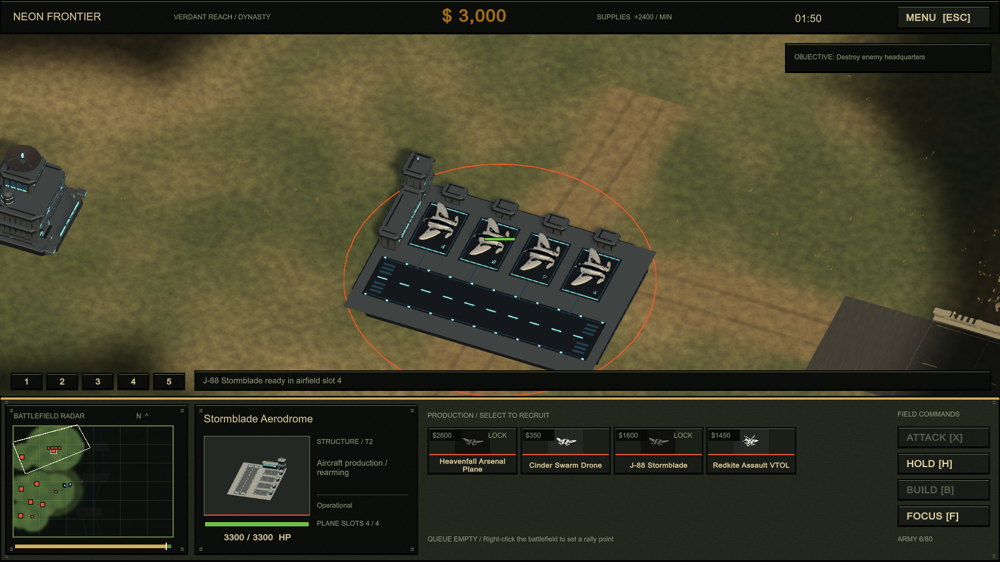
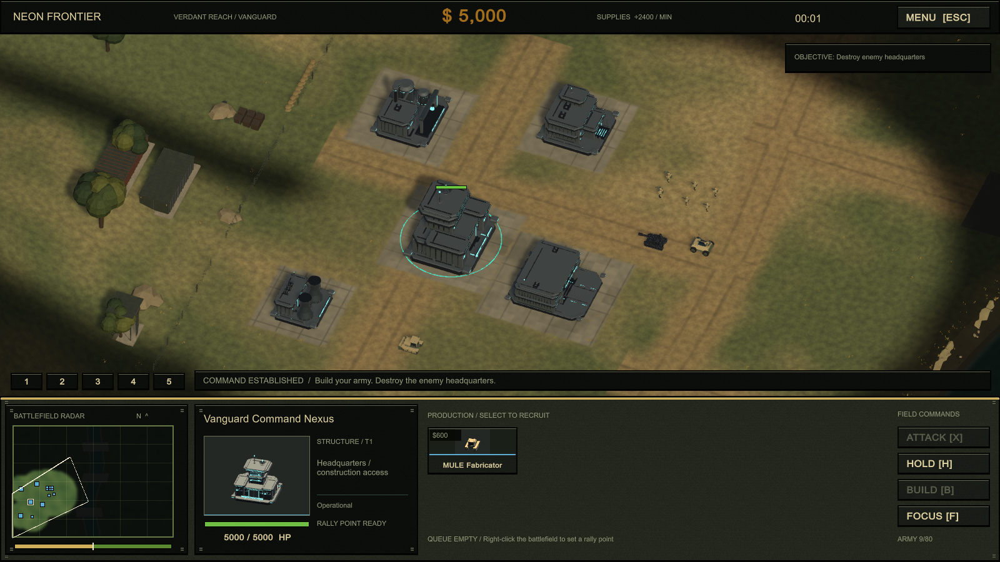
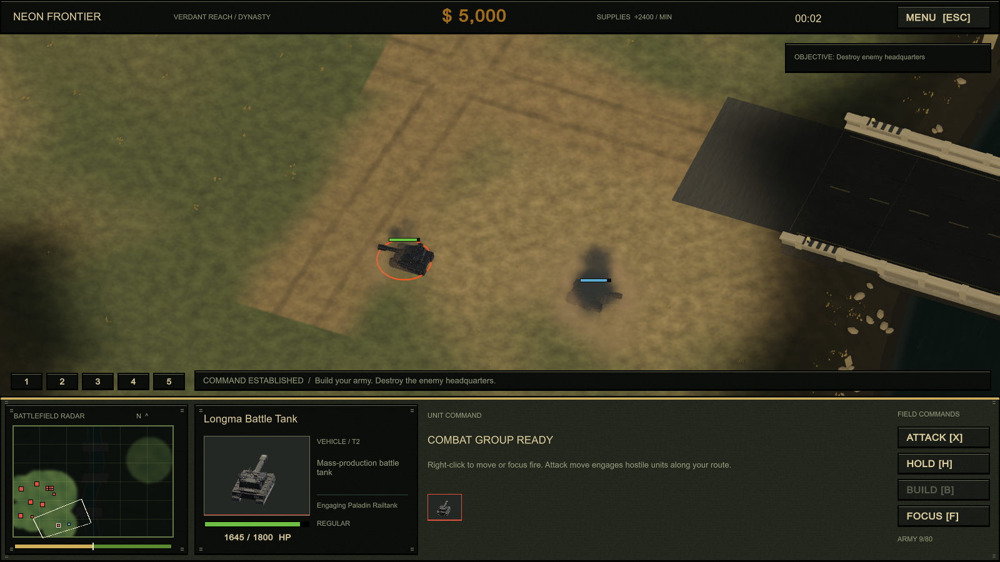
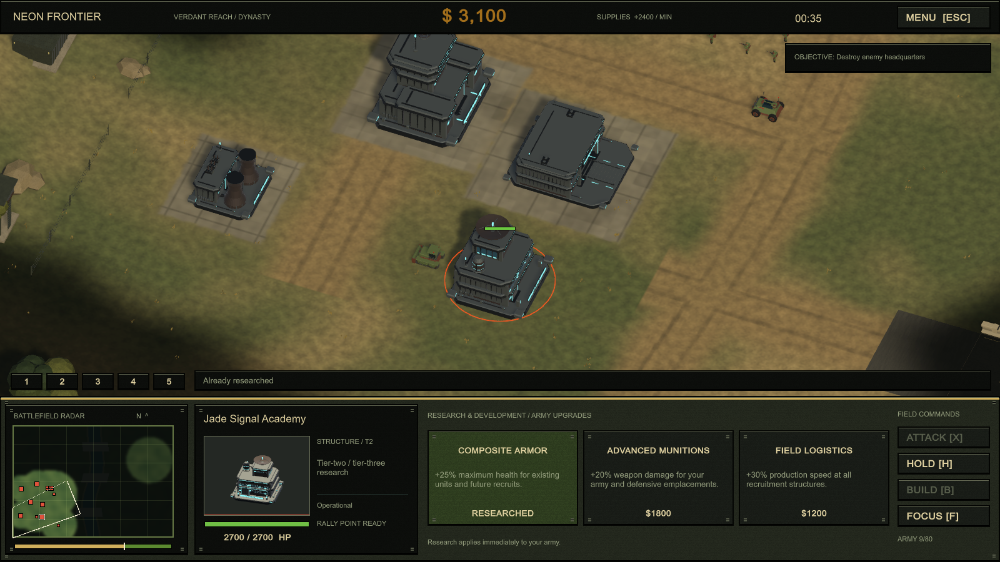
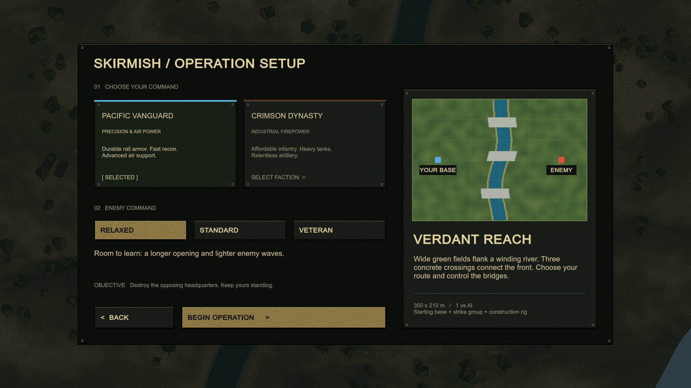

# Neon Frontier

**Build your base. Command the crossing. Bring your army home.**

A single-player military RTS with two original factions, 52 unit and structure variants, and a contested river valley. Establish supply lines, develop your technology, and break through the enemy defenses in a complete skirmish from deployment to victory.

[**Download Windows installer · v0.1.0**](https://github.com/MarwanSummakieh/CnCGenerals-2026-09-05_23-08-25/releases/download/v0.1.0/NeonFrontier-0.1.0-Windows-Setup.exe) · [**Portable Windows x64 ZIP**](https://github.com/MarwanSummakieh/CnCGenerals-2026-09-05_23-08-25/releases/download/v0.1.0/NeonFrontier-0.1.0-Windows-x64.zip) · [Latest release](https://github.com/MarwanSummakieh/CnCGenerals-2026-09-05_23-08-25/releases/latest)



## Play on Windows

Download the **Windows x64 installer**, run it, and launch **Neon Frontier**. The installer installs for your Windows user account and does not require administrator access. Unity, Blender and Git are not required to play.

For a portable installation, download the ZIP, extract the **entire archive**, and run `NeonFrontier.exe` from the extracted game folder. Keep the executable alongside its data folder and supporting files.

From the main menu, choose **Skirmish**, pick a faction and difficulty, then select **Begin Operation**. Destroy the enemy headquarters while protecting your own.

See the [installation guide](Documentation/Installation.md) for updates, uninstalling and checksum verification. The installer is unsigned, so Windows may display an unknown publisher.

## Two armies. Three crossings.

| Faction | Approach |
| --- | --- |
| **Pacific Vanguard** | Reconnaissance, precision armor and air power. |
| **Crimson Dynasty** | Heavy tracked vehicles, concentrated firepower and artillery pressure. |

Each faction fields **16 mobile unit types and 10 structures**. Infantry, construction vehicles, scouts, armor, artillery, air defense and aircraft support different approaches to the battlefield.

**Verdant Reach** spans 300 × 210 meters of grassland, supply tracks and rocky riverbanks. Ground forces use three concrete bridges; aircraft cross directly. Scout ahead to reveal enemy units, secure an approach, and reinforce your attack.



## Built for combined arms

- **Build and reinforce:** construction workers, recurring supply income, production queues, rally points and full refunds for cancelled recruitment. Vehicles roll out of factory bays; soldiers deploy through barracks entrances.
- **Manage your base:** power generation, technology prerequisites and army-wide armor, weapons and production upgrades. Low power slows recruitment and disables powered defenses.
- **Run air sorties:** each airfield reserves four fighter/bomber slots, including queued planes. Aircraft park on distinct pads, carry four ammunition charges, and return to land and rearm.
- **Command the front:** fog of war, veteran ranks, repair support, control groups, attack move, a tactical minimap and model portraits in the command console.
- **See the battle:** traveling shells and missiles, muzzle flashes, explosions, debris, smoke, vehicle dust and scorch marks; rotating turrets, helicopter rotors and construction scaffolding.



<details>
<summary><strong>More screenshots — research and skirmish setup</strong></summary>

Army research offers Composite Armor, Advanced Munitions and Field Logistics.



Choose either faction and one of three enemy difficulty settings.



</details>

## Controls

| Input | Action |
| --- | --- |
| Left-click / drag | Select a unit / a group |
| Shift + click | Add or remove a unit from selection |
| Right-click | Move, attack, or set a building's rally point |
| X, then left-click | Attack move |
| H | Halt; fixed-wing aircraft return to their airfield |
| Tab | Select your combat army |
| Ctrl + 1–5 / 1–5 | Assign / recall a control group |
| Select a construction rig / B | Open construction options |
| WASD / arrows / middle drag | Pan the camera |
| Mouse wheel / Q / E | Zoom / rotate |
| Space / F | Focus headquarters / selection |
| Escape | Pause or cancel the current placement/command |

The in-game **Field Manual** covers controls and the skirmish rules. Click an item in a production queue to cancel it and recover its cost.

## Demo scope

This release is a playable **single-player skirmish demo** with one battlefield, two factions and three difficulty levels. It includes pause, settings, victory/defeat, rematches and a complete base-building loop.

Campaigns, multiplayer, saved matches, transport boarding and stealth/capture abilities are not implemented. Infantry do not have skeletal animation clips. Some roster descriptions contain future design intentions, and balance remains subject to playtesting. The game takes inspiration from classic military RTS games; it does not claim exact visual or gameplay parity with Command & Conquer: Generals.

## Build and develop

The project uses **Unity 6000.3.10f1**, the Universal Render Pipeline and the Input System. Install that editor with Windows build support. Source models and other large art assets use **Git LFS**; install Git with Git LFS before cloning:

```sh
git lfs install
git clone https://github.com/MarwanSummakieh/CnCGenerals-2026-09-05_23-08-25.git
cd CnCGenerals-2026-09-05_23-08-25
git lfs pull
```

Open the cloned repository as a Unity project, then open `Assets/Armies/Scenes/NeonFrontier.unity` to play in the editor. Git LFS is only needed for the source checkout; installer and portable downloads are self-contained.

Build the Windows player with **Neon Frontier → Skirmish → Build Windows Player**, or run from the repository root:

```powershell
powershell -ExecutionPolicy Bypass -File .\Tools\BuildSkirmish.ps1
```

The executable is written to `Builds/NeonFrontierDemo/NeonFrontier.exe`. Use `-SceneOnly` to generate the gameplay scene without building the player. The separate `NeonFrontier_ArmyShowcase.unity` scene lets you inspect the complete model roster.

To package the installer and portable ZIP, run `powershell -ExecutionPolicy Bypass -File .\Tools\BuildInstaller.ps1 -BootstrapCompiler`. This uses a verified Inno Setup compiler and writes release downloads and checksums to `Builds/Releases`. `Tools/TestInstaller.ps1` tests installation, the installed game and removal in an isolated directory; it refuses to replace an existing installation.

| Location | Contents |
| --- | --- |
| `Assets/Armies/Scripts/Gameplay` | Simulation, orders, production, interface and effects |
| `Assets/Armies/Data` | Editable faction roster definitions |
| `Assets/Armies/Prefabs` | Unit and building prefabs |
| `Assets/Armies/Models` | Individual FBX models |
| `ArtSource/Units` and `ArtSource/Structures` | Editable Blender catalogues and art validation reports |
| `Tools/Blender` | Reproducible model generators and export validation |

The original art pipeline uses **Blender 5.2**. Blender is needed to regenerate the art, not to open the existing FBX assets in Unity. Run the generators with Blender's `--background --python` options; see [unit art notes](Documentation/UnitArtNotes.md) and [structure architecture notes](ArtSource/Structures/REFERENCE_ARCHITECTURE.md). Regeneration replaces generated models and related assets, so preserve custom edits before rebuilding them.

### Verification

The final Windows build passed **112/112 runtime checks**, produced **14 valid 1600 × 900 captures**, and recorded **zero runtime errors**. The screenshots in this README are actual GPU renders of the running battlefield and its live interface from that final verification run. Checks exercise the runtime command APIs; they complement manual playtesting.

All **52 exported models** also passed independent import checks for finite geometry, explicit triangles, dimensions and expected mechanical pivots. Airfield and production attachment points were checked separately.

The downloadable installer passed **18 packaging checks**, including silent installation, all 191 payload hashes, Start Menu registration, protection of a running match, the installed player's 112 runtime checks, 14 interface captures, and uninstall cleanup. The portable archive contains the same verified game files. See the [installer verification report](Documentation/Releases/v0.1.0-installer-verification.json).

See the [gameplay verification notes](Documentation/GameplayVerification.md) and [final verification report](Documentation/ReferenceRelease/verification-report.json) for methods, coverage and limitations.
